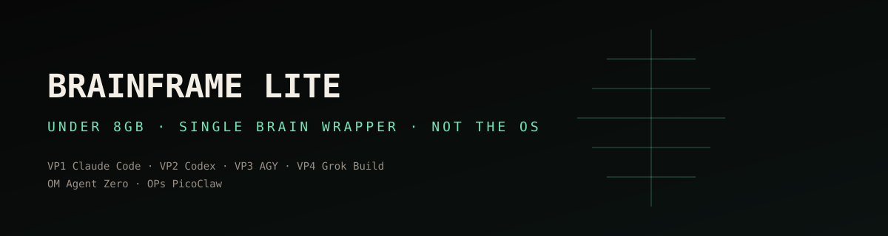
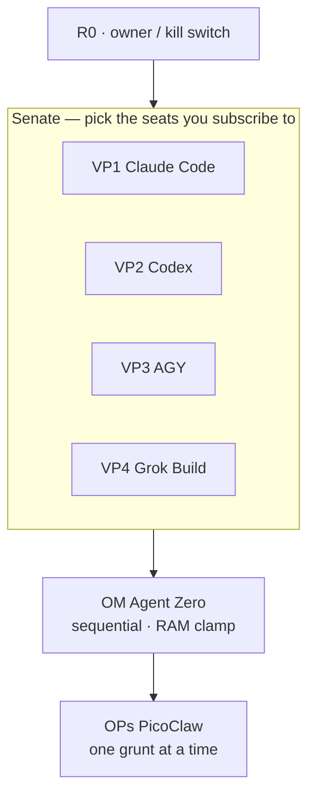

<p align="center">
  
</p>

<p align="center">
  
  
  
</p>

<p align="center"><b>Agentic wrapper sub-OS for <em>one</em> brain. Not BrainFrame OS. Not Helix.</b></p>

The complete operating system stays private until <b>BrainFrame OS: Helix</b> is finished. This repo is only the <b>under-8 GB single-brain install</b>.

| Wrapper | RAM | Operations |
|---|---|---|
| <b>LITE</b> (this repo) | under 8 GB | Agent Zero + PicoClaw · sequential |
| [FULL](https://github.com/CjPetersonIX/brainframe-full) | 8 GB+ | NemoClaw + OpenClaw · parallel |

## Hierarchy



## Install

```bash
curl -fsSL https://raw.githubusercontent.com/CjPetersonIX/brainframe-lite/main/install.sh | bash
```

## CKPT

`<NODE-ID> CKPT <MASTER>.<LOCAL>` — counter, not a float. Skills: [handoff](https://github.com/CjPetersonIX/brainframe-handoff) · [qpulse](https://github.com/CjPetersonIX/brainframe-qpulse).

## Docs

[ARCHITECTURE.md](ARCHITECTURE.md) · [CLAUDE.md](CLAUDE.md) · [docs/TOOL_NODE.md](docs/TOOL_NODE.md) · [docs/TOOL_ARM_HOOK.md](docs/TOOL_ARM_HOOK.md)

Secrets stay local and git-ignored.
