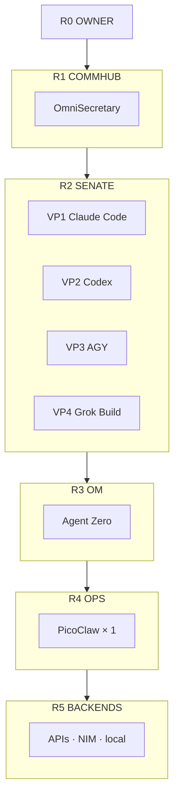

<p align="center">
  
</p>

<p align="center">
  
  
  
</p>

<p align="center"><b>One brain. Under 8 GB. Not the fleet OS.</b></p>

## Corporate tree



Sibling edition (8 GB+): [FULL](https://github.com/CjPetersonIX/brainframe-full) staffs NemoClaw + OpenClaw at R3/R4. Full maps: [docs/HIERARCHY.md](docs/HIERARCHY.md) · [docs/RANKS.md](docs/RANKS.md).

## Install

```bash
curl -fsSL https://raw.githubusercontent.com/CjPetersonIX/brainframe-lite/main/install.sh | bash
```

## CKPT

`<NODE-ID> CKPT <MASTER>.<LOCAL>` · [handoff](https://github.com/CjPetersonIX/brainframe-handoff) · [qpulse](https://github.com/CjPetersonIX/brainframe-qpulse)
