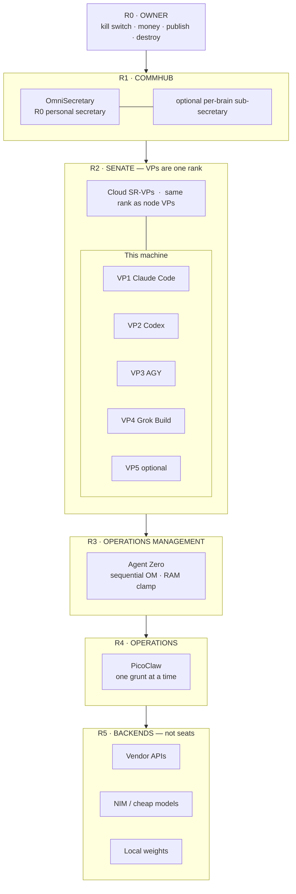
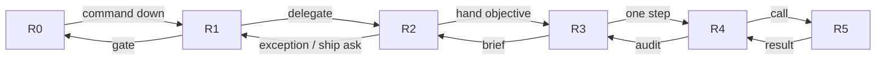

# Hierarchy map — LITE wrapper (under 8 GB)

Top-down corporate tree. Same constitution as FULL. This edition staffs **R3 Agent Zero** and **R4 PicoClaw**.

## The company on one brain

## Command vs approval

## What LITE will not draw

- Parallel OpenClaw on this box — that is FULL
- Frontal Lobe / MasterQ as something you install here
- R4 with publish rights
