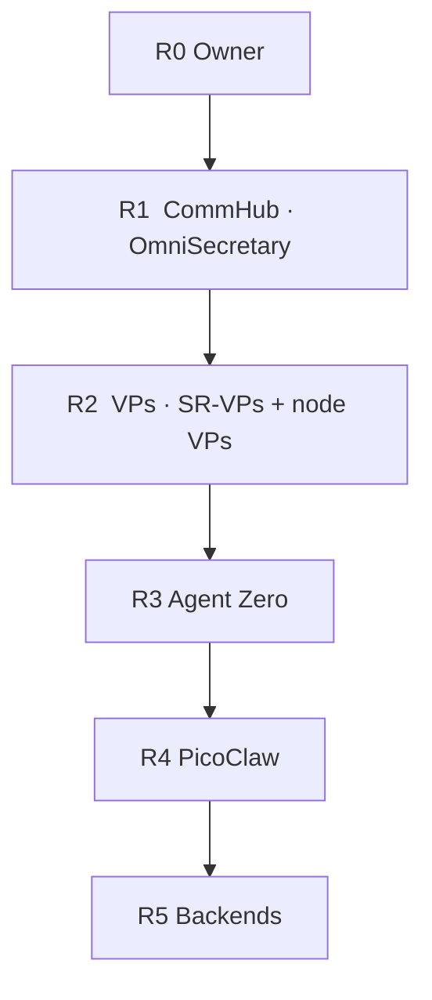

# R0–R5 rank ladder

Authority flows **down**. Approval flows **up**. Same ladder on LITE and FULL. Edition only changes **who sits in R3 and R4**.

Org tree: [HIERARCHY.md](HIERARCHY.md).

| Rank | Name | Who | May |
|---|---|---|---|
| **R0** | Owner | You | Kill switch. Money, destroy, publish. |
| **R1** | CommHub | OmniSecretary + optional sub-secretary | Route, fold pulses. Not a VP. |
| **R2** | VPs | SR-VPs **and** VP1 Claude Code, VP2 Codex, VP3 AGY, VP4 Grok Build (VP5 optional) | Plan and execute. |
| **R3** | OMs | **Agent Zero** | One vertical, RAM clamp. |
| **R4** | OPs | **PicoClaw** | One grunt at a time. |
| **R5** | Backends | APIs, NIM, local weights | Compute only. |

Standalone: R1 may be empty.
