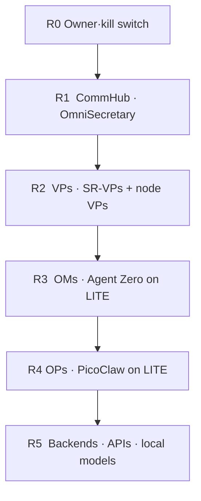

# R0–R5 rank ladder

Authority flows **down**. Approval and exceptions flow **up**. Same ladder on LITE and FULL. The edition only changes **who sits in R3 and R4**.

| Rank | Name | Who | May |
|---|---|---|---|
| **R0** | Owner | You | Kill switch. Money, destroy, publish. |
| **R1** | CommHub | OmniSecretary + optional per-brain sub-secretaries | Route work, fold pulses on a network. Not a VP. |
| **R2** | VPs | Cloud SR-VPs **and** node CLIs: VP1 Claude Code, VP2 Codex, VP3 AGY, VP4 Grok Build (VP5 optional) | Plan and execute. One queue owner at a time. |
| **R3** | OMs | **Agent Zero** on LITE | One vertical, RAM clamp, sequential dispatch. |
| **R4** | OPs | **PicoClaw** | One grunt at a time. No self-authorize outbound. |
| **R5** | Backends | Paid APIs, NIM, local weights | Compute only. Not a seat. |

FULL uses the same table with **NemoClaw (R3)** and **OpenClaw (R4)**.

## Rules

- R2 does not outrank R1. R1 does not outrank R0.
- R4 never publishes, spends, or destroys without an R0 gate.
- R5 is not a person and does not get its own millidigit.
- Standalone box: R1 may be empty. Do not invent a fake CommHub.
- Under 8 GB you stay sequential at R3/R4. That is the edition, not a rank demotion of the VPs.
